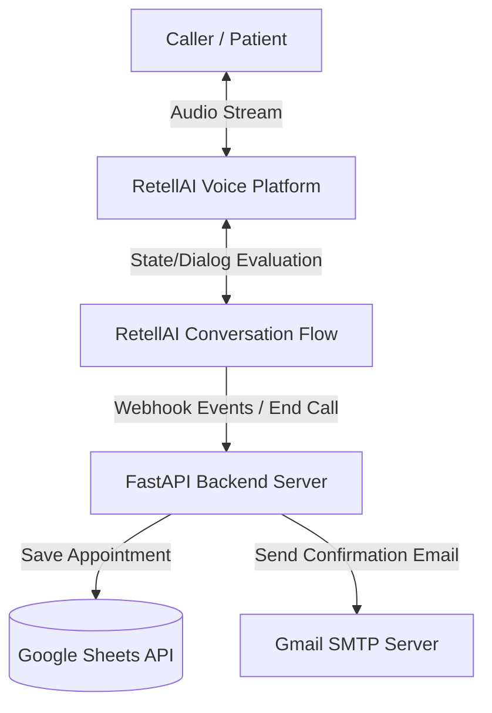

# System Architecture - QuensultingAI Dental Receptionist Voice Agent

This document outlines the architecture, data flow, and components of the dental receptionist voice agent.

## Core System Architecture

The following diagram illustrates the sequence of actions and communication channels:



---

## Component Walkthrough

### 1. Caller / Patient
Initiates a voice call to the dental clinic phone number. The phone number is managed by the telephony provider hooked to RetellAI.

### 2. RetellAI Voice Platform
- Captures incoming audio, processes Speech-to-Text (STT) in real time.
- Communicates directly with the RetellAI Conversation Flow to decide the next conversational steps.
- Processes Text-to-Speech (TTS) to generate natural-sounding voice output for the caller.

### 3. RetellAI Conversation Flow
- A structured graph of nodes and branches mapping out dialogues.
- Evaluates constraints (e.g., patient inputs, FAQ requests).
- Triggers webhooks or api updates to our backend on specific nodes or call completions.

### 4. FastAPI Web Hook Backend (Our Server)
- **API Layer**: Exposes secure webhook listener endpoints.
- **Service Layer**: 
  - Validates RetellAI signatures/payloads.
  - Resolves internal states.
  - Coordinates logging and external services.
- **Config & Core**: Manages security, secrets (Google credentials, SMTP server login), and structured logging.

### 5. Google Sheets API
Stores appointment logs, customer details, and dates. Acts as a lightweight data store, facilitating spreadsheet inspection for clinic receptionists.

### 6. Gmail SMTP
Triggers formatted emails to confirm appointments with patients automatically when booking events complete.

---

## Webhook Architecture Flow

```
Caller
  ↓ (Places call to Retell number)
RetellAI Telephony
  ↓ (Pipes stream to LLM / Flow engine)
RetellAI Conversation Flow
  ↓ (State transition: e.g., Booking Complete)
HTTP Webhook POST
  ↓ (Delivered to FastAPI Endpoint)
FastAPI Backend
  ├─► Appends to Google Sheets (Google Sheets API)
  └─► Dispatches confirmation email (Gmail SMTP)
```
