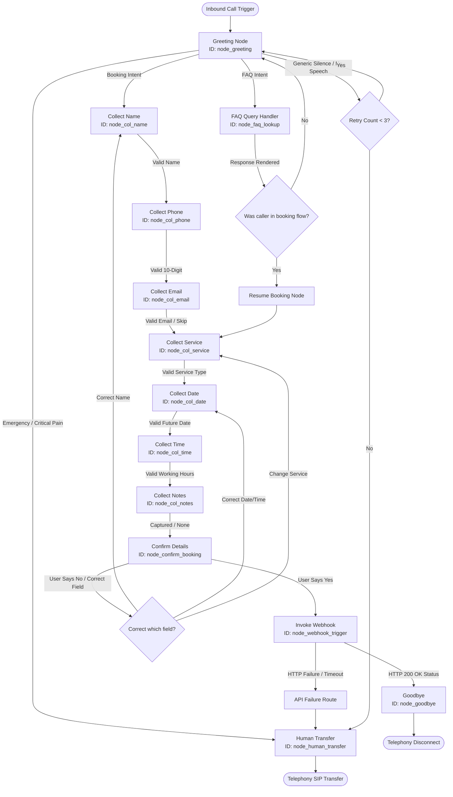

# RetellAI Flow Specification

This document details the conversational routing, decision trees, and event pathways for Clara, the virtual front desk receptionist. It serves as the primary blueprint for implementing the flow inside the RetellAI Flow Builder.

---

## 1. Visual Flow Diagram

---

## 2. Conversation Entry and Exit Specifications

### Entry Node
- **Node ID**: `node_greeting`
- **Type**: Interactive Greeting Node.
- **Entry Trigger**: Triggered automatically when RetellAI answers the incoming SIP trunk trunk stream.

### Exit Nodes
- **Node ID**: `node_goodbye` (Type: Telephony Disconnect / End Call)
  - Triggers the voice agent to speak the final farewell template and immediately signal the telephony server to disconnect/hang up the trunk connection.
- **Node ID**: `node_human_transfer` (Type: Transfer Call Node)
  - Triggers a SIP REFER or standard blind call transfer to the clinic front desk phone number (`+18005550199`).

---

## 3. Core Routing and Decision Node Structures

### Decision Logic (Routing)
1. **Intent Gateways**: Evaluates user response using standard natural language intent classifiers:
   - If Booking: Directs stream state to `node_col_name`.
   - If FAQ: Resolves the canonical query in `node_faq_lookup`.
   - If Emergency / Escalate: Routes immediately to `node_human_transfer`.
2. **Date & Time Validator Nodes**:
   - Compares the date slot against current system timestamp.
   - Rejects Sunday requests and dates that fall in the past.
3. **Confirmation Node**:
   - Synthesizes the captured variables: "I have you down as [Name], booking a [Service] on [Date] at [Time]. Is that correct?"
   - Evaluates boolean yes/no response to route to `node_webhook_trigger` or re-target specific collection nodes.

---

## 4. Alternate Pathways (Retry, Failure, & Interruptions)

### Retry Pathways
- **Slot Failures**: If an input fails validation (e.g. invalid email structure), the flow directs to the slot's respective error handler, incrementing `retry_count`.
- **Threshold**: Clara attempts collection up to a defined ceiling (max 2 for Name/Phone/Email; max 3 for Date/Time). If validation fails repeatedly, state transitions to `node_human_transfer`.

### Failure Pathways
- **API Failure**: If `node_webhook_trigger` times out or returns a non-2xx status, Clara states: "It looks like my reservation portal is experiencing a temporary issue. Let me transfer you directly to our clinic receptionist so we can get this scheduled for you." and triggers `node_human_transfer`.

### Global Interruption Paths
- RetellAI real-time stream interrupts speech immediately. Clara suspends execution and listens to the input.
- If the interruption is a query (FAQ), she resolves the question via `node_faq_lookup` and loops back to the previously active data collection node, restoring all previously saved variables.
- If the interruption corrects previous slot entries, the corresponding slot is updated and Clara validates the new input before proceeding.
